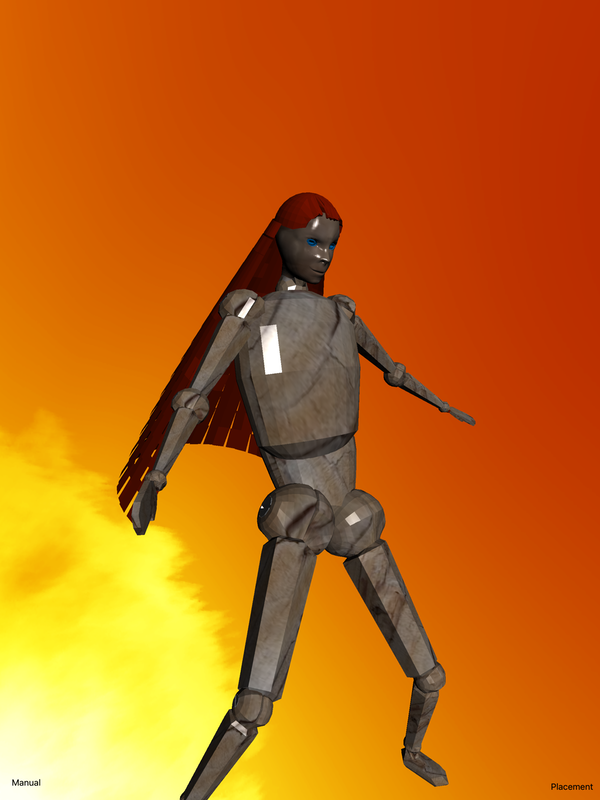

# MetalHairSkyBox
iPad app as testbed for rendering algorithms

step 1: transcribe to Swift (f**king waste of time, but it's what the kids like)

step 2: develop travelling bounding regions that the 'hair' can test against.\
The goal of course is that the hair flows as naturally as possible without intruding the body space. \
Once that's working I've got ideas of how to render more realistic hair and bodies...

step 3: find or develop a Swift class that loads Blender files containing armatures and vertex weights.

step 4: use what I learn to write a new rendition of Manneguin Dancers \
where you can select what hair and clothes the dancers wear. \
https://itunes.apple.com/us/app/mannequin-dancers/id372639614?mt=8

